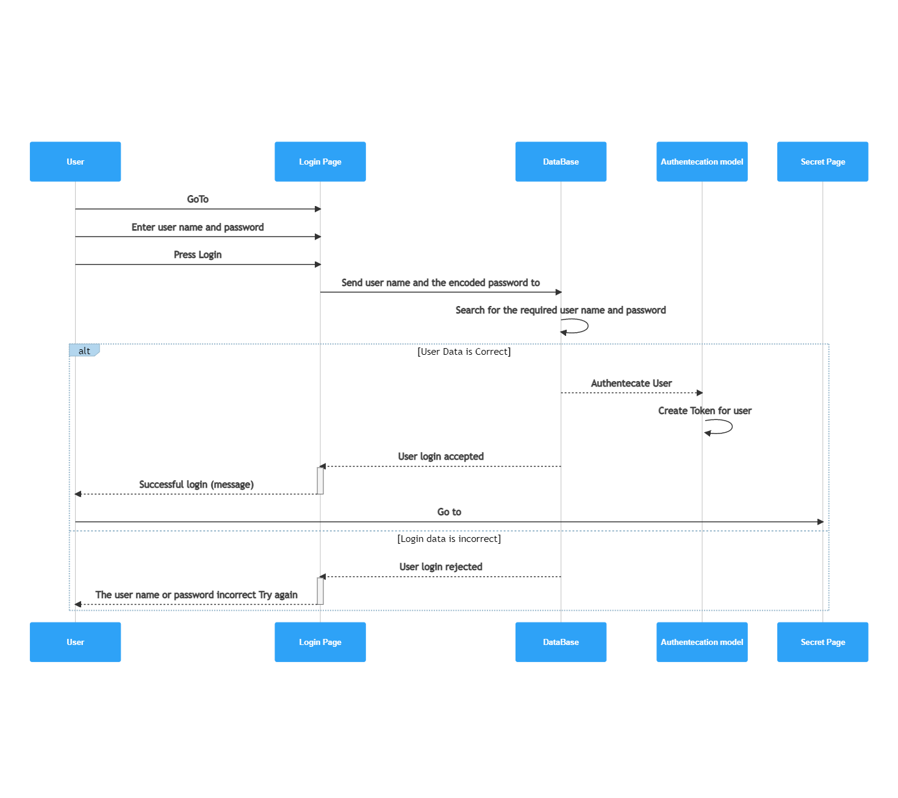

# bearer-auth
### My work Links 
* this is the pull request link [pull request](https://github.com/Muradazzeh/basic-auth/pull/1)
* this is the link for action page from git hub [action page](https://github.com/Muradazzeh/basic-auth/actions)
* this is the link for heroku web site [ herokulink](https://murad-basic-auth.herokuapp.com/)
* this is the link for main repo [ repo link ](https://github.com/Muradazzeh/basic-auth)

## Introduction 
* Using a "Bearer Token" to re-authenticate with a server following a successful login, or obtaining/generating a permanent key
* so In the sign up page after the user enter his details , it will be saved in the data base and the password will be hashed 
* and after that the user will try to sign In so we have to check the user details if it is found in the data base we will generate the token , so he can access other page by his name and password . 
  * so we will start with the UML diagram :

  .jpg)

* then I prepared Authentecation sequance diagrame  for user Log In and how he can get access to other pages 

* I continue on My last task basic Auth code , so I didnt use the starter code that the class provided us .

* in the basic Authentecation part I add extra logic that if the user sign in successfully we have to generat the JSON web token , and we have to send it with the user details so we now that the user is already loged in and I added expiary time for the token , 

* I create new route Secret page with bearer Middle ware , so this middle ware will check for the user token , if if find the token will give the user access to this secret page , I added the test pic using post man 
* first step to sign up as shown 

* second step I need to check the route secret page without loged in 

* Then I need to log in , so token will be generated for the user as shown below : 

* Finally I used generated token in Bearer Authentication to access the secret page 

